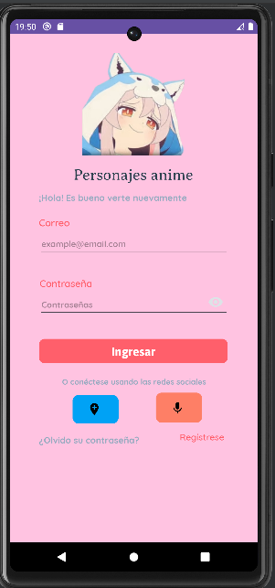
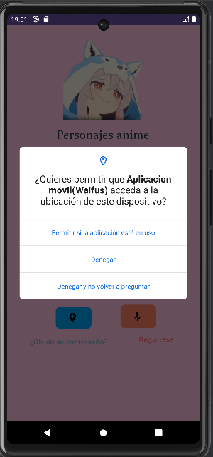
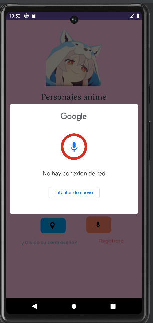
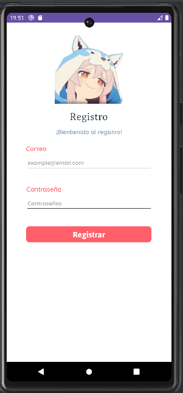
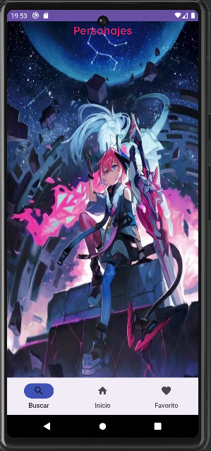
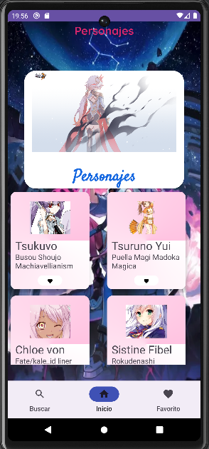
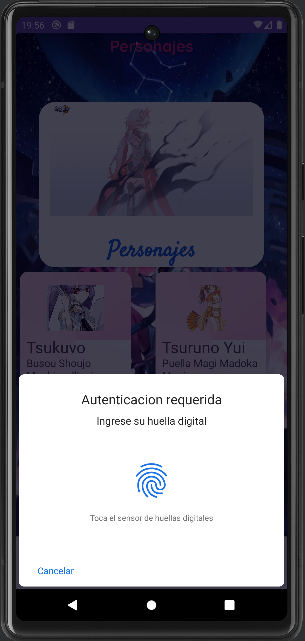
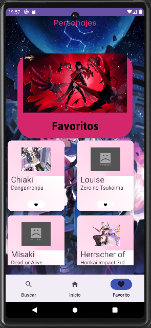
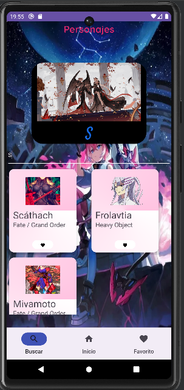
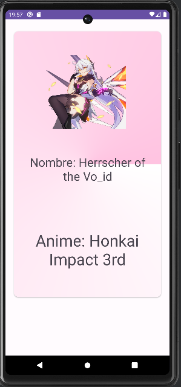

# Series App
La informacion de los personajes proviene de la API Waifu.it: https://waifu.it

## Features
* Personalización de diseños y temas en la interfaz de usuario.
* Utilización del micrófono para acceder al menú de inicio a través de comandos de voz.
* Autenticación mediante Firebase para funciones de inicio de sesión y registro de usuarios.
* Envío y recepción de notificaciones dentro de la aplicación.
* Implementación de una barra de navegación para facilitar la navegación entre secciones.
* Integración de Firebase Database para almacenar y recuperar datos.
* Arquitectura MVVM para una separación clara entre la lógica y la interfaz de usuario.
* Uso de RecyclerView y adaptadores para la presentación eficiente de listas de datos.
* Obtención de información de Waifu.it a través de la conexión a internet.
* Procesamiento de imágenes utilizando la biblioteca Picasso.
* Gestión de la base de datos con Room, incluyendo el uso de Daos y la definición de la estructura de la base de datos.
* Aplicación de la Arquitectura Limpia (Clean Architecture) para separar las capas de datos, lógica y interfaz de usuario.
* Utilización de fragmentos (fragments) y FrameLayouts para crear la estructura de la interfaz.
* Autenticación biométrica mediante la huella digital para aumentar la seguridad.
* Manejo de solicitudes de permisos para garantizar el acceso adecuado a las funciones del dispositivo.
* Consumo de APIs utilizando Retrofit y la conversión de datos con ConverterJson, incluyendo la configuración de puntos finales y la URL base de las APIs.
* Implementación de procesos en segundo plano utilizando corutinas para mejorar la eficiencia y la experiencia del usuario.
* Incorporación de SwipeRefreshLayout para permitir a los usuarios actualizar el contenido mediante un gesto de deslizamiento.
  
## Libraries
* Core
* AppCompat
* Material
* ConstraintLayout
* Navigation Fragment
* JUnit
* JUnit Ext
* Espresso Core
* Picasso
* SwipeRefreshLayout
* Retrofit
* Converter Gson
* Kotlin Coroutines
* Lifecycle Runtime
* Lifecycle ViewModel
* Lifecycle LiveData
* Room Runtime
* Room Compiler
* DataStore Preferences
* Play Services Location
* Fragment KTX
* Activity KTX
* Lifecycle ViewModel KTX
* Lifecycle LiveData KTX
* Biometric
* Shimmer
* Firebase Analytics KTX          
* Firebase Auth KTX
* Firebase database ktx
* Firebase firestore ktx
## Capturas

## Demo

